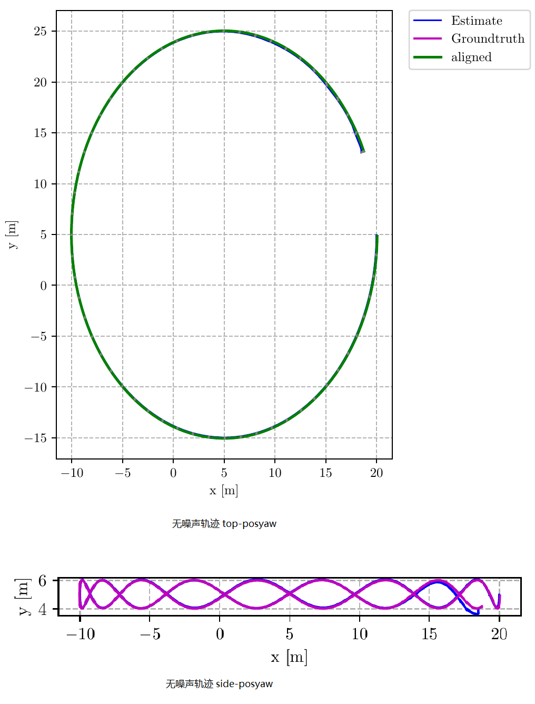
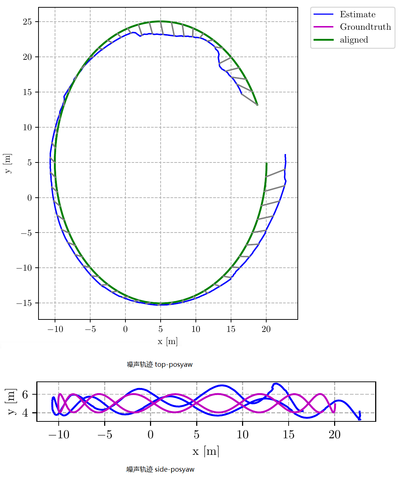
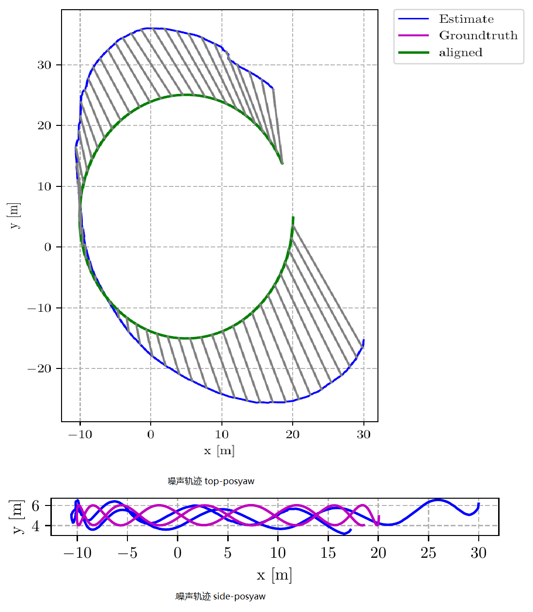
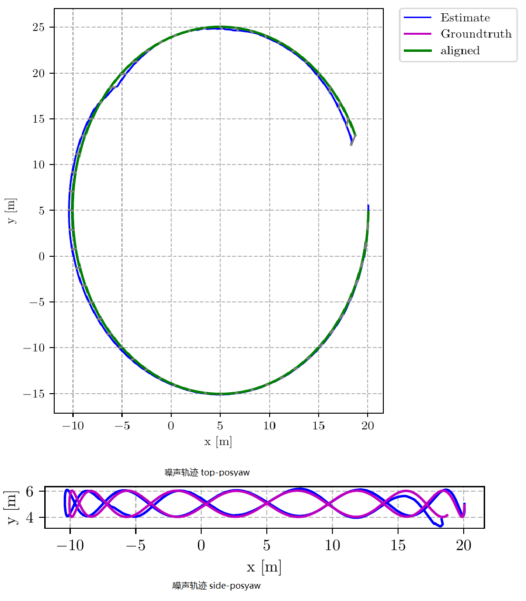

<center><h1 style="color:blue">从零开始手写VIO 第七课作业</h1>
边城量子 2019.08.10</center>

### 1. 将第二讲的仿真数据集(视觉, IMU数据)接入我们的VINS代码, 并运行出轨迹结果.

- 仿真数据集无噪声
- 仿真数据集有噪声(不同噪声设定时, 需要配置 vins 中imu noise大小)


###  回答:

-  <b><font color=red>以下为第三版作业新增内容:</font></b>
  
-  助教评语: <b>对同一噪声数据比较不同配置文件(即yaml中不同IMU参数的设置)对定位精度的影响</b>
  
-  本次修改重点: 针对同一份数据, 比较不同yaml配置文件的轨迹比较.

  

-  比较1: 针对无噪声数据,  两份不同的yaml配置的输出轨迹比较:
  
  - 原始yaml配置:
  
  ```yaml
  #acc_n: 0.019         # accelerometer measurement noise standard deviation. #0.2   0.04
  #gyr_n: 0.015         # gyroscope measurement noise standard deviation.     #0.05  0.004
  #acc_w: 0.0001        # accelerometer bias random work noise standard deviation.  #0.02
  #gyr_w: 1.0e-5       # gyroscope bias random work noise standard deviation.     #4.0e-5
  ```
  
  - 运行, 得到轨迹; 

- 然后将yaml中的配置扩大100倍后,再次运行程序, 得到轨迹. 并进行比较如下:
  
  
  
  - 
   ​     
  
     - 不带噪声IMU数据两种情况下与真值误差数值结果如下: 
     
     | name         | max/m    | mean/m   | rmse/m   | sse     | 轨迹总长/m |
     | ------------ | -------- | -------- | -------- | ------- | ---------- |
     | 原始 yaml    | 1.167762 | 0.812515 | 0.830518 | 128.985 | 110.266    |
     | imu参数100倍 | 1.167276 | 0.812294 | 0.830292 | 128.915 | 110.239    |
     

结果分析：针对【无噪声的IMU 数据集】，由于IMU 信息和视觉信息两者都接近真值，故无论怎么样修改imu 标定噪声参数，即无论如何修改视觉和IMU 权重，对结果影响都不是很大。


- 比较2: 针对噪声数据,  同样执行上述操作,  将两份不同的yaml配置的输出轨迹比较:

    

结果分析：针对【含噪声的IMU 数据集】，原始标定参数，由于IMU 噪声导致轨迹偏移严重，在增
大yaml 中IMU 噪声参数情况下，噪声项的对角协方差矩阵增大，则协方差的逆信息矩阵减小，IMU
的权重变小，更加相信视觉测量，故轨迹正常。


-  <b><font color=red>以下为第二版作业新增内容:</font></b>
  
- 助教评语: <b>增大家对轨迹的量化分析, 及对同一噪声数据比较不同配置文件对定位精度的影响</b>
  
- 本次修改重点:  增加使用评估工具对不同配置文件对定位精度的量化评价
  
  - 本次评估工具为 `uzh-rpg/rpg-trajectory-evaluation`,  具体使用过程可以参考 github 上说明;

  - 本次分为两次评估:  
  
     - 评估1: 仿真数据无噪声
  
     - 评估2: 构造三组有噪声的数据, 分别使用:
  
        - 原始噪声 IMU参数
  
      - x3.0的IMU参数
  
      - /3.0的IMU参数
  
           
  
  - 评估1:  针对仿真数据无噪声:
     - 将无噪声数据集imu-pose.txt 文件输入到vins 系统中，imu 噪声的yaml 参数如下：
  
        ```yaml
        #imu parameters The more accurate parameters you provide , the better performance
        acc_n : 0.019 # accelerometer measurement noise standard deviation . #0.2 0.04
        gyr_n : 0.015 # gyroscope measurement noise standard deviation . #0.05 0.004
        acc_w : 0.0001 # accelerometer bias random work noise standard deviation . #0.02
        gyr_w : 1.0e-5 # gyroscope bias random work noise standard deviation . #4.0e-5
         g_norm : 9.81007 # gravity magnitude
        ```
```

        运行程序, 得到轨迹;
      
      - 针对无噪声imu 数据集进行分析，修改yaml 配置文件中的imu 标定噪声及bias 参数（扩大），并分析其对结果的影响:
     
          ```yaml
          #imu parameters The more accurate parameters you provide , the better performance
          acc_n : 1.90 # accelerometer measurement noise standard deviation . #0.2 0.04
          gyr_n : 1.50 # gyroscope measurement noise standard deviation . #0.05 0.004
          acc_w : 0.01 # accelerometer bias random work noise standard deviation . #0.02
          gyr_w : 1.0e-3 # gyroscope bias random work noise standard deviation . #4.0e-3
          g_norm : 9.81007 # gravity magnitude
```

        运行程序, 得到轨迹;
      
      - 两次的标定参数结果与真值误差对比结果:  


​     
​      
​     
​      不带噪声IMU数据两种情况下与真值误差数值结果如下:
​     
​     | name         | max/m    | mean/m   | rmse/m   | sse     | 轨迹总长/m |
​     | ------------ | -------- | -------- | -------- | ------- | ---------- |
​     | 原始 yaml    | 1.167762 | 0.812515 | 0.830518 | 128.985 | 110.266    |
​     | imu参数100倍 | 1.167276 | 0.812294 | 0.830292 | 128.915 | 110.239    |
​      
     </img>
     
     结果分析: 针对无噪声的IMU数据集, 由于IMU信息和视觉信息两者接近真值, IMU标定噪声参数对结果影响不大.

  


  - 评估2:  针对仿真数据有噪声:
     - 将有噪声数据集imu-pose_noise.txt 文件输入到vins 系统中, 原始的有噪声的imu数据如下:
     
    ```yaml
    acc_n : 0.019 # accelerometer measurement noise standard deviation . #0.2 0.04
    gyr_n : 0.015 # gyroscope measurement noise standard deviation . #0.05 0.004
    acc_w : 0.0001 # accelerometer bias random work noise standard deviation . #0.02
    gyr_w : 1.0e-5 # gyroscope bias random work noise standard deviation . #4.0e-5
    g_norm : 9.81007 # gravity magnitude
    ```
    
    - 修改如上噪声数据, 多次绘制轨迹, 对多次轨迹数据的比较如下表所示：
      
      
      | name              | max/m     | mean/m   | rmse/m   | sse       | 轨迹总长/m |
      | ----------------- | --------- | -------- | -------- | --------- | ---------- |
      | A 有噪声 (原始)   | 3.203756  | 1.340572 | 0.468402 | 1.510936  | 110.179    |
      | B 有噪声 ( x3)    | 22.513000 | 9.931972 | 0.458918 | 11.429269 | 126.996    |
      | C 有噪声 ( /3.0 ) | 1.15201   | 0.345822 | 0.074846 | 0.401324  | 112.373    |
    
      - A 有噪声 (原始):   acc-n: 0.019，gyr-n: 0.015，acc-w: 0.0001，gyr-w: 1.0e-5
      
      </img>
    
      - B 有噪声 (x3):   acc-n: 0.019x3，gyr-n: 0.015x3，acc-w: 0.0001x3，gyr-w: 1.0e-5x3
      
        </img>
    
    - C 有噪声 (/3):   acc-n: 0.019/3.0，gyr-n: 0.015/3.0，acc-w: 0.0001/3.0，gyr-w: 1.0e-5/3.0
      
        </img>
    
    - 结果分析: 
      
        - 需要注意的是, yaml 参数和仿真程序的噪声设置一致, 并不随上述IMU噪声变化而变化
      - 经过量化分析可以看到, 当噪声为x3时, 轨迹漂移严重, 误差较大; 而当噪声为/3.0时, 轨迹接近真实值;
        


- <font color=red><b>以下为第一版既有内容:</b></font>

- <b>整体思路过程:</b>

  - <b>数据文件准备:</b>  整个作业要用第二课代码生成数据文件,  第二课程序运行过程参见第二课文档, 下面重点讲解第二课生成后的数据文件中, 需要用到的三类文件:
    -  <b>Image文件:</b>  Image数据都在 `bin/keyframe` 下,  `all_lines_nnn.txt` 文件(nnn代表数字),  根据第二课代码 `utilities.cpp` 中的 `save_features()` 函数看,  每个文件中都存放着image的points的坐标,  格式为 `x y z 1 u v` , 其中 `(x, y, z)` 为Image的pose,  `(u, v)` 为<font color='red'>归一化平面上</font>的像素坐标(请参见第二课代码, 在输出时, 像素坐标已经做了归一化); 
    - <b>IMU文件:</b>   IMU数据在bin目录下的imu_pose.txt 和 imu_pose_noise.txt, 一个是不带噪声的, 一个是带噪声的; 根据第二课代码utilities.cpp中的save_Pose()函数看, 每个文件中保存的是IMU的测量数据, 格式为 `time  q.w  q.x  q.y  q.z  t0 t1 t2  gyro0  gyro1  gyro2  acc0  acc1  acc2`, 分别是`时间戳  旋转  平移  gyro  acc`; 
    - <b>Image文件对应的时间戳文件: </b> `bin/keyframe` 中的文件中的`points`行, 并不带有时间戳信息,  第二课的代码是仿照TUM的方式, 使用`bin/cam_pose.txt`这个Image位姿文件来记录时间戳,  它的每一行都对应到`bin/keyframe` 目录中的一个文件,  所以这个文件也需要读取, 读取它的第一列时间戳数据作为 `bin/keyframe` 中对应文件的时间戳;
  - <b>数据文件读取编程: </b> 文件读取好之后, 需要读取并解析文件内容, 分为IMU和Image两类:
    2. 第七课的代码是读取EuRoC的数据集的IMU数据以及Image数据的 , 要改成读取上述的文件;
    2.  第七课代码中是读取Image图片,然后提取角点进行跟踪, 但第二课生成的已经是特征点点了,因此要改这部分代码,直接读取特征点;
  - <b>配置文件准备: </b> 要把第二课的参数设置, 变为第七课的 `yaml` 格式, 具体说明如下:
    4. 第二课的一些外参的配置数据是定义在 `param.h` 文件中的, 例如IMU频率, noise等等
    4. 第七课是使用 `yaml` 文件保存参数的;
    4. 因此要根据第二课的参数写一份 `yaml` 文件, 以保证第七课代码按照这些外参来处理数据.

- <b>执行结果:</b>   先展示无噪声和有噪声的执行结果 (针对有噪声列举了三组参数的情况), 然后再详细讲解开发过程; 

  - <font color=red>无噪声</font>情况下, 执行截图如下:

    

    ```shell
    iter: 0 , chi= 6.140108 , Lambda= 500000.000000
    iter: 1 , chi= 5.228841 , Lambda= 304965.555250
    iter: 2 , chi= 5.222351 , Lambda= 101655.185083
    iter: 3 , chi= 5.215390 , Lambda= 33885.061694
    iter: 4 , chi= 5.203370 , Lambda= 11295.020565
    iter: 5 , chi= 5.188376 , Lambda= 3765.006855
    iter: 6 , chi= 5.177777 , Lambda= 1255.002285
    iter: 7 , chi= 5.172609 , Lambda= 418.334095
    iter: 8 , chi= 5.169391 , Lambda= 139.444698
    iter: 9 , chi= 5.167681 , Lambda= 46.481566
    problem solve cost: 85.824247 ms
       makeHessian cost: 58.720183 ms
    ----------- update bprior -------------
                 before: 6446.604701
                         4.005215
                 after: 6643.459320
                        3.989154
    edge factor cnt: 0
    1 BackEnd processImage dt: 95.481682 stamp: 19.966705 p_wi: -0.021015 -2.066730 -0.089363
    
    ```
    
  - <font color=red>有噪声</font>情况(1):  采用第二课默认的噪声参数

    - 噪声:  
      ```yaml
      acc_n: 0.019       
      gyr_n: 0.015 
      acc_w: 0.0001  
      gyr_w: 1.0e-5  
      ```
    - 截图如下:
  

      ```shell
    iter: 0 , chi= 473.873120 , Lambda= 500000.000000
      iter: 1 , chi= 451.735331 , Lambda= 166666.666667
      iter: 2 , chi= 447.013107 , Lambda= 55555.555556
      iter: 3 , chi= 445.226435 , Lambda= 18518.518519
      iter: 4 , chi= 443.881027 , Lambda= 7181.348854
      iter: 5 , chi= 442.622470 , Lambda= 4787.565902
      iter: 6 , chi= 441.588852 , Lambda= 3191.710602
      iter: 7 , chi= 440.589629 , Lambda= 2127.807068
      iter: 8 , chi= 439.489866 , Lambda= 1418.538045
      iter: 9 , chi= 438.199689 , Lambda= 945.692030
      problem solve cost: 104.742582 ms
         makeHessian cost: 77.043999 ms
      ----------- update bprior -------------
                   before: 34350.226414
                           43.123175
                   after: 39869.763292
                          42.930783
      edge factor cnt: 0
      1 BackEnd processImage dt: 121.957470 stamp: 19.966705 p_wi:  1.072711 -1.385537  0.398769

      ```
  
- <font color=red>有噪声</font>情况(2):   相比第二课参数, gyr_w 变大一个数量级,   gyr_n从0.015增大为0.025

  - 噪声:  
    ```yaml
    acc_n: 0.019
    gyr_n: 0.025
    acc_w: 0.0001
    gyr_w: 1.0e-4  
    ```
  - 截图如下:
  

      ```shell
    iter: 0 , chi= 847.428429 , Lambda= 500000.000000
      iter: 1 , chi= 672.488878 , Lambda= 185305.432647
      iter: 2 , chi= 671.576133 , Lambda= 988295.640783
      iter: 3 , chi= 671.377867 , Lambda= 5270910.084175
      iter: 4 , chi= 671.359124 , Lambda= 7027880.112234
      iter: 5 , chi= 671.346347 , Lambda= 37482027.265247
      iter: 6 , chi= 671.207238 , Lambda= 24988018.176831
      iter: 7 , chi= 671.195249 , Lambda= 33317357.569109
      iter: 8 , chi= 671.188364 , Lambda= 44423143.425478
      iter: 9 , chi= 671.183721 , Lambda= 59230857.900638
      problem solve cost: 132.615362 ms
         makeHessian cost: 72.506770 ms
      ----------- update bprior -------------
                   before: 32320.186723
                           66.143780
                   after: 27124.072584
                          65.288490
      edge factor cnt: 0
      1 BackEnd processImage dt: 143.417885 stamp: 19.966705 p_wi: -3.198176 -7.918088  1.

      ```
  
- <font color=red>有噪声</font>情况(3):   相比第二课参数, gyr_w 变大一个数量级,   gyr_n从0.015减小为0.005, acc_n从0.019 减小为 0.001,  acc_w从 0.0001 增大为  0.0002;

  - 噪声:  
    ```yaml
    acc_n: 0.001
    gyr_n: 0.005
    acc_w: 0.0002
    gyr_w: 1.0e-5
    ```
  - 截图如下:
  

      ```shell
    iter: 0 , chi= 415.169866 , Lambda= 500000.000000
      iter: 1 , chi= 408.441531 , Lambda= 333333.333333
      iter: 2 , chi= 408.440760 , Lambda= 7281777777.777779
      iter: 3 , chi= 408.439266 , Lambda= 310689185185.185181
      iter: 4 , chi= 408.439053 , Lambda= 1657008987654.320801
      iter: 5 , chi= 408.439020 , Lambda= 8837381267489.710938
      sqrt(currentChi_) <= stopThresholdLM_
      problem solve cost: 85.169250 ms
         makeHessian cost: 37.999698 ms
      ----------- update bprior -------------
                   before: 99876.230406
                           34.877407
                   after: 95316.902088
                          33.176471
      edge factor cnt: 0
      1 BackEnd processImage dt: 97.560266 stamp: 19.966705 p_wi:  0.290740 -0.361437  0.530511
      ```
  
- ##### 详细过程讲解:

  - ##### 数据文件准备
    
    - 把第二课数据(即bin下的数据文件)拷贝到第七课的 `bin/data` 下, 拷贝后如下:
    
      ```shell
      hadoop@ubuntu:~/Documents/vins_sys_code/bin/data$ ls
      all_points.txt    data_gen                imu_int_pose.txt    keyframe
      cam_pose_tum.txt  demo.png                imu_pose_noise.txt
      cam_pose.txt      imu_int_pose_noise.txt  imu_pose.txt
      
      ```
    
  - <b>设置配置文件</b>

    - 根据第二课的 `param.h` 中的参数的值, 参考第七课中 `config/euroc_config.yaml` 的格式和内容, 编写自己的 `simulation_config.yaml` 文件, 内容如下,  刷新的有 图片尺寸 `image_width , image_height`, 相机内参 `fx, fy, cx, cy`,  偏差与噪声 `acc_n, gyr_n,  acc_w, gyr_w `, 其他数值基本可以复用`euroc_config.yaml`的 ;

      ```
      %YAML:1.0
      
      #common parameters
      imu_topic: "/imu0"
      image_topic: "/cam0/image_raw"
      output_path: "/home/hadoop/Documents/vins_sys_code/result"
      
      #camera calibration 
      model_type: PINHOLE
      camera_name: camera
      image_width: 640
      image_height: 640
      distortion_parameters:
         k1: 0
         k2: 0
         p1: 0
         p2: 0
      projection_parameters:
         fx: 460
         fy: 460
         cx: 255
         cy: 255
      
      # Extrinsic parameter between IMU and Camera.
      estimate_extrinsic: 0   # 0  Have an accurate extrinsic parameters. We will trust the following imu^R_cam, imu^T_cam, don't change it.
                              # 1  Have an initial guess about extrinsic parameters. We will optimize around your initial guess.
                              # 2  Don't know anything about extrinsic parameters. You don't need to give R,T. We will try to calibrate it. Do some rotation movement at beginning.                        
      #If you choose 0 or 1, you should write down the following matrix.
      #Rotation from camera frame to imu frame, imu^R_cam
      extrinsicRotation: !!opencv-matrix
         rows: 3
         cols: 3
         dt: d
         data: [0, 0, -1,
               -1, 0,  0,
                0, 1,  0]
      #Translation from camera frame to imu frame, imu^T_cam
      extrinsicTranslation: !!opencv-matrix
         rows: 3
         cols: 1
         dt: d
         data: [0.05, 0.04, 0.03]
      
      #feature traker paprameters
      max_cnt: 150            # max feature number in feature tracking
      min_dist: 30            # min distance between two features 
      freq: 30                # frequence (Hz) of publish tracking result. At least 10Hz for good estimation. If set 0, the frequence will be same as raw image
      F_threshold: 1.0        # ransac threshold (pixel)
      show_track: 1           # publish tracking image as topic
      equalize: 1             # if image is too dark or light, trun on equalize to find enough features
      fisheye: 0              # if using fisheye, trun on it. A circle mask will be loaded to remove edge noisy points
      
      #optimization parameters
      max_solver_time: 0.04  # max solver itration time (ms), to guarantee real time
      max_num_iterations: 8   # max solver itrations, to guarantee real time
      keyframe_parallax: 10.0 # keyframe selection threshold (pixel)
      
      #imu parameters       The more accurate parameters you provide, the better performance
      acc_n: 0.019         # accelerometer measurement noise standard deviation. #0.2   0.04
      gyr_n: 0.015         # gyroscope measurement noise standard deviation.     #0.05  0.004
      acc_w: 0.0001        # accelerometer bias random work noise standard deviation.  #0.02
      gyr_w: 1.0e-5       # gyroscope bias random work noise standard deviation.     #4.0e-5
      g_norm: 9.81007     # gravity magnitude
      
      #loop closure parameters
      loop_closure: 0                    # start loop closure
      load_previous_pose_graph: 0        # load and reuse previous pose graph; load from 'pose_graph_save_path'
      fast_relocalization: 0             # useful in real-time and large project
      pose_graph_save_path: "/home/weihao/Desktop/From Zero to One VIO/homework/vins_sys_code/result/" # save and load path
      
      #unsynchronization parameters
      estimate_td: 0                      # online estimate time offset between camera and imu
      td: 0.0                             # initial value of time offset. unit: s. readed image clock + td = real image clock (IMU clock)
      
      #rolling shutter parameters
      rolling_shutter: 0                  # 0: global shutter camera, 1: rolling shutter camera
      rolling_shutter_tr: 0               # unit: s. rolling shutter read out time per frame (from data sheet). 
      
      #visualization parameters
      save_image: 0                   # save image in pose graph for visualization prupose; you can close this function by setting 0 
      visualize_imu_forward: 0        # output imu forward propogation to achieve low latency and high frequence results
      visualize_camera_size: 0.4      # size of camera marker in RVIZ
      
      ```
    
  - <b>数据文件读取编程: </b> 
    
    - 整个程序编写涉及新增或修改如下几个文件:
      - `test/run_simulation.cpp` :  新增, 程序入口, 仿照` run_euroc.cpp`编写, 用于触发读取imu,image数据, 并启动多个线程进行优化和图形绘制;
      - `src/System.cpp`: 修改, 重载其中的`PubImageData()`函数, 读取`keyframe`下的文件中的数据, 做适当转换后,  保存到变量 `feature_points` 中;
      
    - `test/run_simulation.cpp` 代码如下:
    
      ```c++
      //
      // Author: Arthur <shihezichen@live.cn>
      // Date:  2019.08.10
      // Description: 
      //    Read the IMU and Image data from data files and do the 
      // optimization of them , then draw the final trajectory.
      
      
      #include <unistd.h>
      #include <stdio.h>
      #include <stdlib.h>
      #include <string.h>
      #include <iostream>
      #include <thread>
      #include <iomanip>
      
      #include <cv.h>
      #include <opencv2/opencv.hpp>
      #include <highgui.h>
      #include <eigen3/Eigen/Dense>
      #include "System.h"
      
      using namespace std;
      using namespace cv;
      using namespace Eigen;
      
      const int nDelayTimes = 2;
      
      
      std::shared_ptr<System> pSystem;//宏定义整个VIO系统类
      
      // 获取IMU数据
      void PubImuData(string  sData_path)
      {
       
          string sImu_data_file = sData_path + "imu_pose.txt";
          cout << "1 PubImuData start sImu_data_filea: " << sImu_data_file << endl;
          ifstream fsImu;
          fsImu.open(sImu_data_file.c_str());
          if (!fsImu.is_open())
          {
              cerr << "Failed to open imu file! " << sImu_data_file << endl;
              return;
          }//读取文件
      
          std::string sImu_line;
          double dStampNSec = 0.0;//时间戳
          Vector3d vAcc;//加速度
          Vector3d vGyr;//陀螺仪
          Eigen::Quaterniond q;
          Eigen::Vector3d t;
          while (std::getline(fsImu, sImu_line) && !sImu_line.empty()) // read imu data
          {
              std::istringstream ssImuData(sImu_line);
              ssImuData >> dStampNSec >> q.w() >> q.x() >> q.y() >> q.z() >> t(0) >> t(1) >> t(2) >> vGyr.x() >> vGyr.y() >> vGyr.z() >> vAcc.x() >> vAcc.y() >> vAcc.z();
              //cout << "Imu t: " << fixed << dStampNSec << " gyr: " << vGyr.transpose() << " acc: " << vAcc.transpose() << endl;
              pSystem->PubImuData(dStampNSec, vGyr, vAcc);
              usleep(5000*nDelayTimes);//将调用usleep函数的线程挂起一段时间,单位是微秒
          }
          fsImu.close();
      }
      
      // 获取图像数据
      void PubImageData(string sData_path)
      {
          // 由于 keyframe 文件夹下的文件中每一行的image的point没有时间戳, 
          // 因此通过读取图像位姿文件cam_pose_tum.txt, 它对应行的第一列时间戳可作为point的的时间戳
          string sImage_file = sData_path + "cam_pose_tum.txt";
          cout << "1 PubImageData start sImage_file image timestamp: " << sImage_file << endl;
          ifstream fsImage;  //图像位姿文件,这里主要是需要图像的时间戳
          fsImage.open(sImage_file.c_str());
          if (!fsImage.is_open())
          {
              cerr << "Failed to open image file! " << sImage_file << endl;
              return;
          }
      
          std::string sImage_line;
          double dStampNSec;
          int file_count = 0;//标记keyframe下对应的feature文件
      
          // cv::namedWindow("SOURCE IMAGE", CV_WINDOW_AUTOSIZE);
          while (std::getline(fsImage, sImage_line) && !sImage_line.empty())
          {
              std::istringstream ssImuData(sImage_line);//读取图像位姿文件,为了得到时间戳
              ssImuData >> dStampNSec;
              //cout << "Image t : " << fixed << dStampNSec << endl;
              std::stringstream featurePath;
              featurePath<<sData_path<<"keyframe/all_points_"<<file_count<<".txt";
              string sfeaturePath = featurePath.str();
              //cout<<sfeaturePath<<endl;
              pSystem->PubImageData(dStampNSec, sfeaturePath);
              usleep(50000*nDelayTimes);
              file_count++;
          }
          fsImage.close();
      }
      
      int main(int argc, char **argv)
      {
          if(argc != 3)
          {
              cerr << "./run_simulation PATH_TO_FOLDER/bin/ PATH_TO_CONFIG/config \n"
                   << "For example: ./run_simulation ./ ../config/"<< endl;
              return -1;
          }
          // 保存数据的文件夹, 例如 bin/data/
          string sData_path = argv[1];
          string sConfig_path = argv[2];
          pSystem.reset(new System(sConfig_path));//核心类
          // std::thread 初始化为函数,表示直接执行函数,初始化为类函数,则后边应该跟着类
          std::thread thd_BackEnd(&System::ProcessBackEnd, pSystem);//后端优化最重要的
      
          // sleep(5);
          std::thread thd_PubImuData(PubImuData, sData_path);//获取IMU数据线程
      
          std::thread thd_PubImageData(PubImageData, sData_path);//获取图像数据线程
      
          std::thread thd_Draw(&System::Draw, pSystem);//显示轨迹线程
      
          // 数据运行完就把线程停掉,但画图和主线程仍然在运行
          thd_PubImuData.join();
          thd_PubImageData.join();
      
           thd_BackEnd.join();
           thd_Draw.join();
      
          cout << "main end... see you ... <Ctrl>+C to exit." << endl;
          return 0;
      }
      
      ```

    - `src/System.cpp` 中重载的函数 `PubImageData` 代码如下:
    
      ```c++
      // 重载图像获取函数,直接获取特征点,并赋值给 feature_points
      void System::PubImageData(double dStampSec, string &feature_name)
      {
          // 特征点文件操作并判断文件是否能够正常打开
          std::ifstream f;
          f.open(feature_name.c_str());
          if(!f.is_open())
          {
              std::cerr << "can not open image feature file:"<<feature_name<<std::endl;
              return;
          }
      
          //flag赋值
          if (!init_feature)
          {
              // 跳过第一张图片,因为不能计算光流速度
              cout << "1 PubImageData skip the first detected feature, which doesn't contain optical flow speed" << endl;
              init_feature = 1;
              return;
          }
      
          if (first_image_flag) //第一张图片
          {
              cout << "2 PubImageData first_image_flag" << endl;
              first_image_flag = false;
              first_image_time = dStampSec;
              last_image_time = dStampSec;
              return;
          }
          // detect unstable camera stream
          // 检查当前帧和上一帧图像的时间戳,假如太大则lost
          if (dStampSec - last_image_time > 1.0 || dStampSec < last_image_time)
          {
              cerr << "3 PubImageData image discontinue! reset the feature tracker!" << endl;
              first_image_flag = true;
              last_image_time = 0;
              pub_count = 1;
              return;
          }
          last_image_time = dStampSec;
      
          PUB_THIS_FRAME = true;
          TicToc t_r;
          // 新建一帧图像特征来保存模拟数据保存好的特征点
          if(PUB_THIS_FRAME)
          {
              pub_count++;
              shared_ptr<IMG_MSG> feature_points(new IMG_MSG());
              feature_points->header = dStampSec;
              int pts_id = 0;
              // 逐行读取特征点
              while(!f.eof())
              {
                  std::string s;
                  std::getline(f,s);
                  if(! s.empty())
                  {
                      //将读取到的一行数据赋值给ss(x,y,z,1,u,v)
                      std::stringstream ss;
                      ss<<s;
                      Eigen::Vector4d point_3d;
                      double u, v;
                      ss >> point_3d(0) >> point_3d(1) >> point_3d(2) >> point_3d(3) >> u >> v;
                      // 其中(u,v)已经是归一化平面上的坐标,且非畸变
                      double x = u;
                      double y = v;
                      double z = 1.0;
                      // 通过畸变公式, 求得畸变下的坐标(即成像平面上的坐标)
                      double image_u = FOCAL_LENGTH * u + COL/2.0;
                      double image_v = FOCAL_LENGTH * v + ROW/2.0;
                      // 保存归一化平面上的坐标
                      feature_points->points.push_back(Vector3d(x, y, z));
                      // pts_id 在本例中暂时不涉及, 被置为0
                      feature_points->id_of_point.push_back(pts_id);
                      // 保存成像平面上的坐标
                      feature_points->u_of_point.push_back(image_u);
                      feature_points->v_of_point.push_back(image_v);
                      // 速度在本例中暂时不涉及, 被置为0
                      feature_points->velocity_x_of_point.push_back(0);
                      feature_points->velocity_y_of_point.push_back(0);
                  }
                  pts_id++;
              }
      
              if (!init_pub)
              {
                  cout << "4 PubImage init_pub skip the first image!" << endl;
                  init_pub = 1;
              }
              else
              {
                  m_buf.lock();
                  feature_buf.push(feature_points);//图像特征点的buffer
                  // cout << "5 PubImage t : " << fixed << feature_points->header
                  //     << " feature_buf size: " << feature_buf.size() << endl;
                  m_buf.unlock();
                  con.notify_one();
              }
          }
      }
      ```
    
    - 编译运行:  
    
      - 由于需要得到带有噪声和不带噪声的两个图形,  因此需要针对带有噪声和不带噪声两种情况,  修改 `run_simulation.cpp` 代码中 ` PubImuData()` 函数中的 `string sImu_data_file = sData_path + "imu_pose_noise.txt";`  使之分别读取 `imu_pose.txt` 和 `imu_pose_noise.txt` , 然后分别编译和执行;  
      
      - 整个编译执行过程如下:
      
      ```shell
      mkdir build
      cd build
      cmake ..
      make -j4
      cd ../bin
       ./run_simulation  ./data/ ../config/
      ```