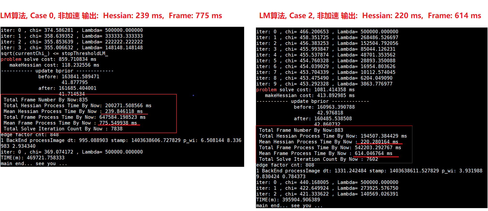
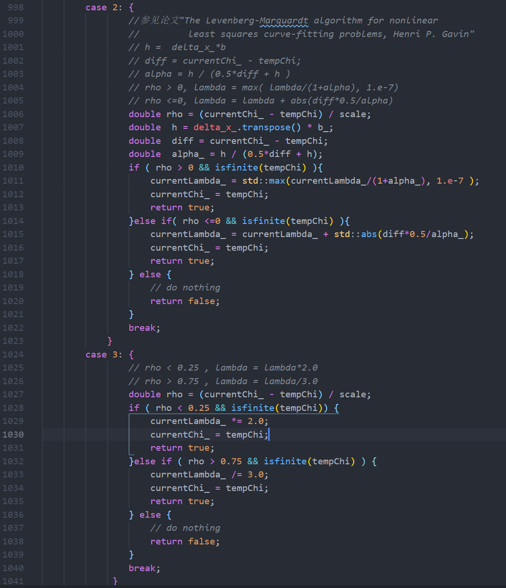
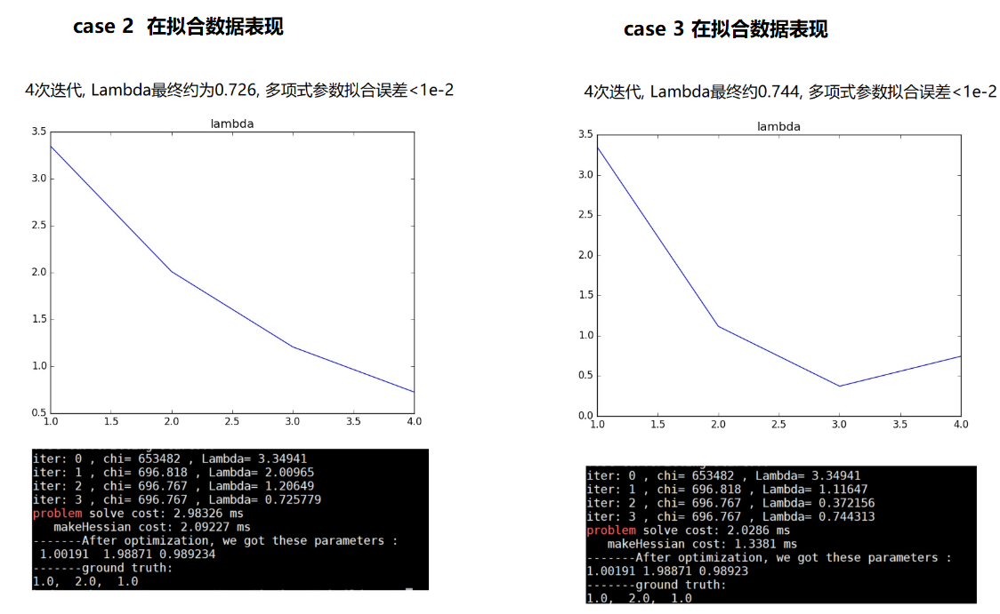
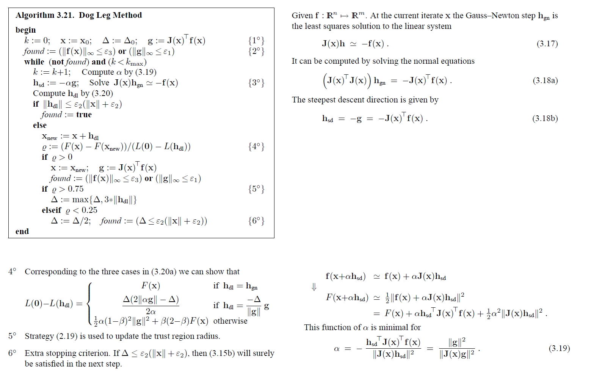
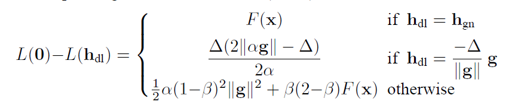
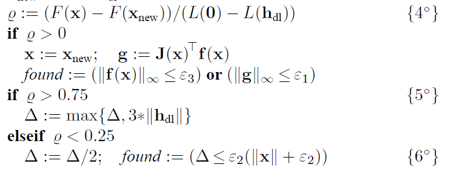
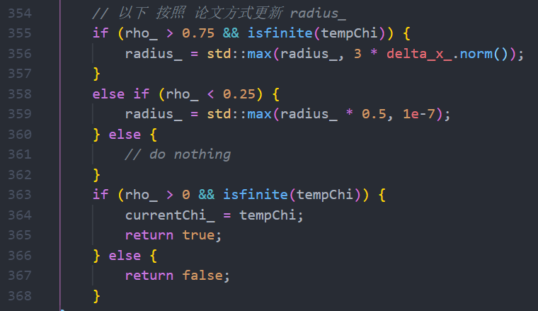
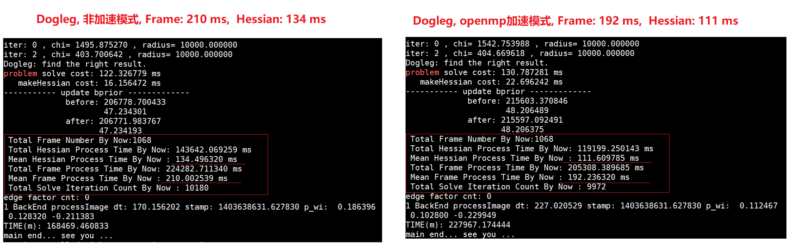
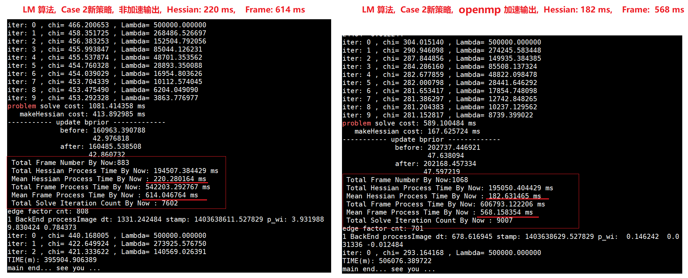

<center><h1 style="color:blue">从零开始手写VIO 大作业</h1>
    边城量子 2019.08.20</center>

### 1. 题目1: 更优的优化策略:

   a. 选用更优的 LM 策略, 使得 VINS-Mono 在 MH-05 数据集上收敛速度更快或者精度更高.  

   b. 实现 dog-leg 算法替换 LM 算法, 并测试替换后的 VINS-Mono 在 MH-05 上算法精度.    

   详细的实验报告,包括: 对迭代时间和精度进行评估, 其中精度评估可以采用 evo 工具( https://github.com/MichaelGrupp/evo ) 对轨迹精度进行评估, 轨迹真值在 zip 中已给出.   或者使用 rpg 工具(https://github.com/uzh-rpg/rpg_trajectory_evaluation  刀耕火种推荐) 


### 2. 题目 1 问题 a 解答: LM 策略优化

-  <b>先说本题目结论:</b>
  
  - 下图为LM算法非加速情况下, 原策略(即 case 0 )  vs 新策略(Case2) 的输出, 可见平均 Frame 处理时长从**775 ms ** 降低为 **614 ms**:
  
    
  - 两种策略的 平均Frame处理时长 对比 如下表所示:  Frame处理时长加速效果约 *20.8%* 
  
    <center><b>LM算法非加速情况下, case 0与 case 2两种策略的耗时对比</b></center>
    | 测试项                  | 原策略( case 0) | 新策略 ( case 2 ) | 加速效果                     |
    | ----------------------- | --------------- | ----------------- | ---------------------------- |
    | 平均Frame处理时长(ms)   | 775.55          | 614.05            | <font color=red>20.8%</font> |
    | 平均Hessian处理时长(ms) | 239.85          | 220.28            | <font color=red>8.2%</font>  |
  
  
  
-  <b>以下讲述详细过程</b>

-  <font color=blue>新增LM策略</font>:

  -  修改 `Problem.cc` , 在 `bool Problem::IsGoodStepInLM() ` 函数中添加如下两种新的选项,  此方式参考了 代码如下:
  
  
  
  代码片段如下:
  
  ```c++
  case 2: {
      //参见论文"The Levenberg-Marquardt algorithm for nonlinear 
      //         least squares curve-fitting problems, Henri P. Gavin"
      // h =  delta_x_*b 
      // diff = currentChi_ - tempChi;
      // alpha = h / (0.5*diff + h )
      // rho > 0, lambda = max( lambda/(1+alpha), 1.e-7)
      // rho <=0, lambda = lambda + abs(diff*0.5/alpha)
      double rho = (currentChi_ - tempChi) / scale;
      double  h = delta_x_.transpose() * b_;
      double  diff = currentChi_ - tempChi;
      double  alpha_ = h / (0.5*diff + h);
      if ( rho > 0 && isfinite(tempChi) ){
          currentLambda_ = std::max(currentLambda_/(1+alpha_), 1.e-7 );
          currentChi_ = tempChi;
          return true;
      }else if( rho <=0 && isfinite(tempChi) ){
          currentLambda_ = currentLambda_ + std::abs(diff*0.5/alpha_);
          currentChi_ = tempChi;
          return true;
      } else {
          // do nothing
          return false;
      }
      break;
  }
  case 3: {
      // rho < 0.25 , lambda = lambda*2.0
      // rho > 0.75 , lambda = lambda/3.0
      double rho = (currentChi_ - tempChi) / scale;
      if ( rho < 0.25 && isfinite(tempChi)) {
          currentLambda_ *= 2.0;
          currentChi_ = tempChi;
          return true;
      }else if ( rho > 0.75 && isfinite(tempChi) ) {
          currentLambda_ /= 3.0;
          currentChi_ = tempChi;
          return true;    
      } else {
          // do nothing
          return false;
      }
      break;
  }
  ```
  
  
  
-  <font color=blue>加入整体的Frame相关处理的计时和打印代码</font>

   - 修改 `problem.h`, 在类中加入如下成员变量:
   
      ```c++
      public:
          //To do: 此处为了简化编码, 变量设置为public, 后续可改为private
          // 每一 frame 处理 hessian 的时长, 来自于 MakeHessian 函数中记录
          double hessian_time_per_frame = 0.0;
          // 每一 frame 处理时长,  来自于 MakeHessian 函数中记录
          double time_per_frame = 0.0;
          // 每一 frame 求解的次数, 来自 SolveXXX 函数中的 iter 累加
          long  solve_count_per_frame = 0;
      ```
   
      
   
   - 修改 `problem.cc`,  在 `Problem::Solve()` 函数名末尾加入计时语句, 用于记录本 frame 的hessian处理时长, 求解时长, 以及求解的迭代次数;
   
      ```c++
          std::cout << "problem solve cost: " << t_solve.toc() << " ms" << std::endl;
          std::cout << "   makeHessian cost: " << t_hessian_cost_ << " ms" << std::endl;
      
          // ----- new code start -----
          // 记录本次Hessian处理时长
          hessian_time_per_frame = t_hessian_cost_; 
          // 记录本次frame时长(包括hessian时长)
          time_per_frame = t_solve.toc();  
          // 记录本frame的求解次数
          solve_count_per_frame = iter;
          // ----- new code end -----    
         
          t_hessian_cost_ = 0.;
          return true;
      ```
   
      
   
   - 修改 `estimator.h`  , 在类中加入如下成员变量, 用于记录 hessian 总时长, frame总处理时长, frame总数, 求解迭代次数总数:
   
      ```c++
          // 记录所有 frame 的 hessian 处理时间( 此值随帧不断处理, 会不断累加 )
          double total_hessian_time = 0.0;
          // 记录所有 frame 的处理时长( 此值随帧不断处理, 会不断累加 )
          double total_frame_time = 0.0;   
          // 记录所有 frame 的个数
          long total_frame_num = 0;
          // 记录所有 frame 的solve 次数总和
          long solve_count_per_frame = 0;
      ```
   
      
   
   - 修改 `estimator.cpp`,  在 `void Estimator::problemSolve()` 函数末尾加入计时和打印语句, 在每次处理完一frame后都打印截至当前总的 hessian 处理时间, 总的frame 处理时间, 平均hessian处理时间, 平均hessian处理时间, 以及总的 solve 迭代次数:
   
      ```c++
          // update bprior_,  Hprior_ do not need update
          if (Hprior_.rows() > 0)
          {
              std::cout << "----------- update bprior -------------\n";
              std::cout << "             before: " << bprior_.norm() << std::endl;
              std::cout << "                     " << errprior_.norm() << std::endl;
              bprior_ = problem.GetbPrior();
              errprior_ = problem.GetErrPrior();
              std::cout << "             after: " << bprior_.norm() << std::endl;
              std::cout << "                    " << errprior_.norm() << std::endl;
          }
          // ---- new code start ----
          total_hessian_time += problem.hessian_time_per_frame;
          total_frame_num ++;
          total_frame_time += problem.time_per_frame;
          solve_count_per_frame += problem.solve_count_per_frame;
      
          std::cout << " Total Frame Number By Now:" << total_frame_num <<  std::endl;
          std::cout << " Total Hessian Process Time By Now: " << total_hessian_time  <<  " ms" << std::endl;
          std::cout << " Mean Hessian Process Time By Now : " << total_hessian_time/double(total_frame_num) << " ms" << std::endl;
          std::cout << " Total Frame Process Time By Now: " << total_frame_time  <<  " ms" << std::endl;
          std::cout << " Mean Frame Process Time By Now : " << total_frame_time/double(total_frame_num) << " ms" << std::endl;
          std::cout << " Total Solve Iteration Count By Now : " << solve_count_per_frame << " ms" << std::endl;
          // ---- new code end ----
      ```
   
      
   
-  <font color="blue">运行仿真程序,  查看拟合结果和lambda变化情况:</font>

   
   
- <font color=blue>在MH-05数据集上运行,  比较总耗时时间</font>:  

  - 备注: 限于时间下面重点针对最终较好的新策略 case 2进行比较
  
  - 修改 `bool Problem::IsGoodStepInLM()` 函数中的 `option` 选项为 0 和 2, 分别代表原来的策略因子和新的策略因子,  并记录最终的耗时情况:
  
  - 下图为LM算法非加速情况下, 原策略(即 case 0 )  vs 新策略(Case2) 的输出, 可见平均 Frame 处理时长从 **775 ms ** 降低为 **614 ms**:
  
    
  
  
  
  
  - 两种策略的 平均Frame处理时长 对比:  Frame处理时长加速效果约 *20.8%* 
  
    <center><b>LM算法非加速情况下, case 0与 case 2两种策略的耗时对比</b></center>
    | 测试项                  | 原策略( case 0) | 新策略 ( case 2 ) | 加速效果                     |
    | ----------------------- | --------------- | ----------------- | ---------------------------- |
    | 平均Frame处理时长(ms)   | 775.55          | 614.05            | <font color=red>20.8%</font> |
    | 平均Hessian处理时长(ms) | 239.85          | 220.28            | <font color=red>8.2%</font>  |
    
     


### 3. 题目 1 问题 b 解答: dog-leg 算法 实现

- <b><font color=red>dog-leg算法分析</font></b>

  -  dog-leg 大体算法流程如下所示,  参考论文 GN-LM算法.pdf ( `METHODS FOR NON-LINEAR LEAST SQUARES PROBLEMS 2nd Edition, April 2004,  K. Madsen, H.B. Nielsen, O. Tingleff` )

    </img>
  
    
  
  - <font color=blue>分析1: 针对 $\alpha$ 求值的分析</font>
    
      针对上图右下角对 $\alpha$  的求值公式:  $\alpha=-\frac{\mathbf{h}_{\mathrm{sd}}^{\top} \mathbf{J}(\mathbf{x})^{\top} \mathbf{f}(\mathbf{x})}{\left\|\mathbf{J}(\mathbf{x}) \mathbf{h}_{\mathrm{sd}}\right\|^{2}}=\frac{\|\mathbf{g}\|^{2}}{\|\mathbf{J}(\mathbf{x}) \mathbf{g}\|^{2}}$
    
    * 根据论文中 公式 3.18b 可知   $\mathbf{h}_{sd} = - \mathbf{g} = - \mathbf{J}(x)^\top \mathbf{f}(x)$,  $$,  有 `g=-b_`
    
    * 因此上式 $\alpha$ 求解对应的代码为:  
    
        `alpha_ = b_.squaredNorm() / (b_.transpose()*Hessian_*b_); ​`
    
        
    
  - <font color=blue>分析2: 针对上午左下角的公式: </font>
    
    - 此公式对应 `IsGoodStepInDogleg()` 中的 `scale` 因子的求解
      
        
      
    - 其中的 $\Delta$ 对应变量 `radius_`,  $\mathbf{h}_{dl}, \mathbf{h}_{gn}$ 对应变量 `h_dl_, h_gn_`,   $\alpha$ 对应上面求得得变量 `alpha_` , 整体对应代码如下图所示;  同时也参考了G2O的代码,  且经过实际测试对比发现G2O的的 $\rho$  计算方式效率上会更好一些.    因此这里有两种选项供选择, 一种是论文的策略, 一种是G2O的方式:
      
        
    
        
      
    - 上式中的 $\beta$ 的计算需参考论文中的公式 3.20b:
    
        
      
    - 此公式对应的代码如下:

        
    
  - <font color=blue>分析3: 针对上午左上角的公式: </font>
    
      
    
    - 此公式对应的代码如下:
    
        
    
      
    
  
  


  - <b><font color=red>dog-leg算法实现详解:</font></b>
    
      - 修改 ` problem.cc`, 将 `Problem::Solve(int iterations)` 函数改名为 `Problem::SolveLM(int iterations)` , 代表原来的 `LM` 算法的实现; 
        
    - 修改 `problem.cc`, 在文件首部定义各种所需的选项参数, 通过这些选项参数变化组合, 就可以编译出多个 加速 或非加速, LM或Dogleg, 以及各种 strategy 的 可执行程序:
      
      ```c++
      // 编译选项  To Do: 此处使用变量定义, 未来可改成使用配置文件保存
      
      // 控制使用LM 或者Dogleg,   0: LM,   1: Dogleg
      const int alogrithm_option = 1;  
      
      // 控制是否使用加速, 以及加速方式
      //   0: Normal,non-acc,   1: OpenMP acc,   2: Multi Threads acc
      const int acc_option = 1;  
      // 控制LM算法中的IsGoodStep的策略(不影响Dogleg)
      //   0: 原策略;  1: 原策略;  2: 新策略(主选);   3: 新策略(不建议)
      const int lm_strategy_option = 2;  
      
      // 控制Dogleg法中的IsGoodStep的策略
      //   0: 论文的rho_计算策略;  1: 和g2o一致的rho_计算策略
      const int dogleg_strategy_option = 1;  
      
      // 控制 LM 或者 Dogleg 算法的chi和lambda初始化选项
      //   0:Nielsen; 1:Levenberg;  2:Marquardt;  3:Quadratic;  4:Doglet
      const int chi_lambda_init_option = 4;  
      ```
      
      
      
    - 修改 `problem.h`,  新增两个函数 `SolveDogleg(int iterations)` 和 `SolveLM(int iterations)` 的定义,  修改后的代码如下:
      
        ```c++
            /**
             * 求解此问题
             * @param iterations
             * @return
             */
            bool Solve(int iterations = 10);
            // 使用LM进行求解
            bool SolveLM(int iterations = 10);
            // 使用Dogleg进行求解
            bool SolveDogleg(int iterations = 10);
            // Dogleg策略因子, 用于判断 Lambda 在上次迭代中是否可以，以及Lambda怎么缩放
            bool Problem::IsGoodStepInDogleg();    
        ```
      
    - 修改 `problem.cc`, 新增函数 `Problem::Solve(int iterations)`, 负责进行LM或者Dogleg算法的选择, 代码如下:
      ```c++
    // 负责负责进行LM或者Dogleg算法的选择和分发
      bool Problem::Solve(int iterations){
          bool result = false;
          // 算法选项
          int option = alogrithm_option;   // 0: LM,   1: Dogleg 
          switch(option) {  
              case 0: result = SolveLM(iterations);
                  break;
              case 1: result = SolveDogleg(iterations);
                      break;
              default:
                  std::cerr << "Unkown solve option : "<< option << std::endl;
                      result = false;
                      break;
          }
          return result;
      }
      ```
    
    - 修改 `problem.cc`, 新增函数 `Problem::SolveDogleg(int iterations)`, 实现`Dogleg`算法, 代码如下:
    
        ```C++
        // Dogleg 方法
        // 1、设置参数： 初始值，信赖域上界，信赖域半径，\mu
        // 2、寻找最优解：首先确定方向，再确定步长 
        bool Problem::SolveDogleg(int iterations) {
        if (edges_.size() == 0 || verticies_.size() == 0) {
            std::cerr << "\nCannot solve problem without edges or verticies" << std::endl;
                return false;
            }
        
        TicToc t_solve;
            // 统计优化变量的维数，为构建 H 矩阵做准备
            SetOrdering();
            // 遍历edge, 构建 H 矩阵。里面有delta_x_初值
            MakeHessian(); 
        
        // 使用新的 Chi 和 Lambda 的初始化
            //ComputeLambdaInitLM();
            ComputeChiInitAndLambdaInit();
            
        // 尝试把 r 从1 增大到 1e4 来避免MH-05数据集上漂移的问题
            bool found = false;
            radius_ = 1e4;
        
            //bool stop = false;
            int iter = 0;
    const int numIterationsMax = 10;
            double last_chi_ = 1e20;
        
            while ( !found && (iter < numIterationsMax)) {
                std::cout << "iter: " << iter << " , chi= " << currentChi_ << " , radius= " << radius_ << std::endl;
            iter++;
        
                bool oneStepSuccess = false;
                int false_cnt = 0;
                while (!oneStepSuccess && false_cnt < 10)  // 不断尝试 Lambda, 直到成功迭代一步
            {
                // 计算alpha 和 h_gn 
                    double alpha_ = b_.squaredNorm() / ( (Hessian_ * b_).dot(b_) );
                    //alpha_ = b_.squaredNorm() / (b_.transpose()*Hessian_*b_);
                    h_sd_ = alpha_ * b_;
                // To Do: 此处Hessian_比较大, 直接求逆很耗时, 可采用 Gauss-Newton法求解
                    //h_gn_ = Hessian_.inverse() * b_;
                    h_gn_ = Hessian_.ldlt().solve(b_);
        
                    double h_sd_norm = h_sd_.norm();
                    double h_gn_norm = h_gn_.norm();
                // 计算h_dl 步长
                    if ( h_gn_norm <= radius_){
                        h_dl_ = h_gn_;
                    // 此处条件判断直接用了 h_sd_norm, 和论文的 alpha_*h_sd_norm不同
                    }else if ( alpha_*h_sd_norm >= radius_ ) { 
                        h_dl_ = ( radius_ / h_sd_norm ) * h_sd_;
                    } else {
                        // 计算beta用于更新步长
                        // 此处a直接等于 h_sd_, 和论文的 alpha_* h_sd_ 有所不同
                    //VecX a = alpha_ * h_sd_;            
                    VecX a  = h_sd_;
                        VecX b = h_gn_;
                        //double c = a.transpose() * (b - a);
                        double c = a.dot( b - a );
                    if (c <= 0){
                            beta_ = ( -c + sqrt(c*c + (b-a).squaredNorm() * (radius_*radius_ - a.squaredNorm())) )
                                     / (b - a).squaredNorm();
                        }else{ 
                            beta_ = (radius_*radius_ - a.squaredNorm()) / (c + sqrt(c*c + (b-a).squaredNorm() 
                                    * (radius_*radius_ - a.squaredNorm())));
                    }
                        assert(beta_ > 0.0 && beta_ < 1.0 && "Error while computing beta");
                        // 此处 a 直接等于 h_sd_, 和论文的有所不同
                        h_dl_= a + beta_ * ( b - a );
                } 
                    delta_x_ = h_dl_;
        
                    UpdateStates();
                    oneStepSuccess = IsGoodStepInDogleg();
                    // 后续处理，
                if(oneStepSuccess)
                    {
                        MakeHessian();
                        false_cnt = 0;
                    }
                    else
                    {
                        false_cnt++;
                        RollbackStates();
                    }
    
                }
                iter++;
        
                if(last_chi_ - currentChi_ < 1e-5  || b_.norm() < 1e-5 )
                {
                    std::cout << "Dogleg: find the right result. " << std::endl;
                    found = true;
                }
                last_chi_ = currentChi_;
            }
        std::cout << "problem solve cost: " << t_solve.toc() << " ms" << std::endl;
            std::cout << "   makeHessian cost: " << t_hessian_cost_ << " ms" << std::endl;
            // 记录本次Hessian处理时长
            hessian_time_per_frame = t_hessian_cost_; 
            // 记录本次frame时长(包括hessian时长)
            time_per_frame = t_solve.toc();
            // 记录本frame的求解次数
            solve_count_per_frame = iter;
              
            t_hessian_cost_ = 0.;
            return true;
        }
        ```

    - 修改 `problem.cc`, 新增函数 `Problem::IsGoodStepInDogleg()`  , Dogleg策略因子, 用于判断 `Lambda` 在上次迭代中是否可以，以及 `Lambda` 怎么缩放:
    
        ```c++
        // Dogleg策略因子, 用于判断 Lambda 在上次迭代中是否可以，以及Lambda怎么缩放
    bool Problem::IsGoodStepInDogleg(){
            double tempChi = 0.0;
            for (auto edge: edges_) {
                edge.second->ComputeResidual();
                tempChi += edge.second->RobustChi2();
            }
            if (err_prior_.size() > 0)
                tempChi += err_prior_.norm();
        tempChi *= 0.5;          // 1/2 * err^2
        
            // 计算rho
        double rho_ ;
            int option = dogleg_strategy_option;  // 0: 论文策略;  1: 和g2o一致的策略
            switch ( option ) {
                case 0:{  // 论文策略, 计算 rho 
                    // scale 即为论文中的 L(0) - L(h_dl), 参看 论文 4°和 3.20a 的公式说明
                    double scale=0.0;
                    if(h_dl_ == h_gn_){
                    scale = currentChi_;
                    } else if(h_dl_ == radius_ * b_ / b_.norm()) {
                        scale = radius_ * (2 * (alpha_ * b_).norm() - radius_) / (2 * alpha_);
                } else { 
                        scale = 0.5 * alpha_ * pow( (1 - beta_), 2) * b_.squaredNorm() 
                                    + beta_ * (2 - beta_) * currentChi_;
                    }
                    // rho = ( F(x) - F(x_new) ) / ( L(0) - L(h_dl) )
                    rho_ = ( currentChi_ - tempChi )/ scale;
                    break;
                }
                case 1: {  // 按照 g2o 方式 计算 rho_
                    double linearGain = - double(delta_x_.transpose() * Hessian_ * delta_x_) 
                                            + 2 * b_.dot(delta_x_);
                    rho_ = ( currentChi_ - tempChi ) / linearGain;
                    break;
                }
            }
        
            // 以下 按照 论文方式更新 radius_
            if (rho_ > 0.75 && isfinite(tempChi)) {
                radius_ = std::max(radius_, 3 * delta_x_.norm());
            }
            else if (rho_ < 0.25) {
                radius_ = std::max(radius_ * 0.5, 1e-7);
        } else {
                // do nothing
            }
            if (rho_ > 0 && isfinite(tempChi)) {
                currentChi_ = tempChi;
                return true;
            } else {
                return false;
            }
        }
        ```

      - 修改 `problem.cc`, 新增函数 `Problem::ComputeChiInitAndLambdaInit()`  , 负责 `Chi` 和 `Lambda `初始化: 
    
        ```c++
        // Chi 和 Lambda 初始化
        void Problem::ComputeChiInitAndLambdaInit()
        {
            currentChi_ = 0.0;
            for (auto edge: edges_) {
                // 在MakeHessian()中已经计算了edge.second->ComputeResidual()
                currentChi_ += edge.second->RobustChi2();
            }
            if (err_prior_.rows() > 0)
                currentChi_ += err_prior_.squaredNorm();
            currentChi_ *= 0.5;
        
            maxDiagonal_ = 0;
            ulong size = Hessian_.cols();
            assert(Hessian_.rows() == Hessian_.cols() && "Hessian is not square");
            for (ulong i = 0; i < size; ++i) {
                maxDiagonal_ = std::max(fabs(Hessian_(i, i)), maxDiagonal_);
            }
            maxDiagonal_ = std::min(5e10, maxDiagonal_);
        
            int option = chi_lambda_init_option; // 0:Nielsen; 1:Levenberg;  2:Marquardt;  3:Quadratic;  4:Doglet
            switch (option) {
                case 0: // NIELSEN:
                    ComputeLambdaInitLM_Nielsen();
                    break;
                case 1: // LEVENBERG
                    ComputeLambdaInitLM_Levenberg();
                    break;
                case 2:  // MARQUARDT
                    ComputeLambdaInitLM_Marquardt();
                    break;
                case 3:  // QUADRATIC
                    ComputeLambdaInitLM_Quadratic();
                    break;
                case 4:  // DOGLEG
                    ComputeLambdaInitDogleg();
                    break;
                default:
                    cout << "Please choose correct LM strategy in .ymal file: 0 Nielsen; 1 LevenbergMarquardt; 2 Quadratic" << endl;
                    exit(-1);
                    break;
            }
        }
        void Problem::ComputeLambdaInitLM_Nielsen() {
            ni_ = 2.;
            stopThresholdLM_ = 1e-10 * currentChi_;          // 迭代条件为 误差下降 1e-6 倍
            double tau = 1e-5;  // 1e-5
            currentLambda_ = tau * maxDiagonal_;
            std::cout << "currentLamba_: "<<currentLambda_<<", maxDiagonal: "<<maxDiagonal_<<std::endl;
        }
        void Problem::ComputeLambdaInitLM_Levenberg() {
            currentLambda_ = 1e-2;
            lastLambda_ = currentLambda_;
        }
        void Problem::ComputeLambdaInitLM_Marquardt() {
            double tau = 1e-5;  // 1e-5
            currentLambda_ = tau * maxDiagonal_;
        }
        void Problem::ComputeLambdaInitLM_Quadratic() {
            double tau = 1e-5;  // 1e-5
            currentLambda_ = tau * maxDiagonal_;
        }
        void Problem::ComputeLambdaInitDogleg() {
            currentLambda_ = 1e-7;
        }
        ```


​        ​    
  - <b><font color=red>dog-leg 实现的执行:</font></b>
    
- 输出结果:  
  
    
    
    *注: 此处openmp加速结果需依赖题目2中代码完成; 此处为保信息整体性, 提前把openmp加速后的Dogleg结果统一列在表格中*

<center><b>Dogleg算法耗时</b></center>

| 测试项                  | Dogleg算法 | Dogleg算法(openmp加速) |
| ----------------------- | ---------- | ---------------------- |
| 平均Frame处理时长(ms)   | 210.00     | 192.24                 |
| 平均Hessian处理时长(ms) | 134.50     | 111.61                 |


###  4. 题目2:  更快的 makehessian 矩阵:

- 可以采⽤任何⼀种或多种加速⽅式 (如多线程, 如sse指令集等) 对信息矩阵的拼接函数加速, 并给出详细的实验对⽐报告.

  

### 5. 题目 2 解答:

- <b><font color=red>将分别介绍使用openMP加速和手写多线程加速两种方式</font></b>

- 先说结论:

  
<center><b>LM算法, Case2, 非加速与openmp加速 对比表</b></center>
|     测量项    | 非加速 数据 (ms) | openmp 加速 数据 (ms) | 加速效果 |
| ------- | ---------: | ------------: | ----------: |
| 平均Frame处理时长   | 614.05 |     568.16 |    7.49% |
| 平均Hessian处理时长 | 220.28 |     182.63 |    17.3% |


<center><b>LM算法, Case2, 非加速与手工多线程加速 对比表</b></center>
测量项 | 非加速(ms) | 手工多线程加速(ms) |  加速效果  
-| -:|-:|-:
平均Frame处理时长 | 614.05 | 1165.01 |          
平均Hessian处理时长 | 220.28 | 21.95 | 

<font color=red>备注:  手工多线程方式 当前运行后数据不太正确, 待进一步排查原因</font>


- 编译说明: 根据选项不同, 编译出多种可执行程序, 以便于分别运行并测试其数据
  - `void Problem::MakeHessian() ` 中的 `option` 代表加速模式, 0:不加速; 1:`openmp`加速,  2:手工多线程加速;   
  - `Problem::Solve()` 中的 `option` 代表所使用的算法, 0:`LM`算法;   1:`Dogleg`算法;  将其置为0, 代表使用 `lm` 算法;
  - `Problem::IsGoodStepInLM()` 中的 `option` 代表`LM`算法中的策略, 0:代表原策略;   2:代表新策略; 将其置为 2, 表示使用新的优化后的策略 case 2;
  - 在代码写完做多种加速模式比较时,  通过对上述 `option` 的组合, 编译后可以得到不同的可执行程序 ,如下表所示:

  <center><b>可执行程序与对应选项关系 表</b></center>
| No.  | bin 下可执行文件名              | 算法   | IsGoodStepXXX策略              | 加速       |
| ---- | ------------------------------- | ------ | ------------------------------ | ---------- |
| 1    | run_euroc_lm_case0              | LM     | LM 原策略( case 0 )            | N/A        |
| 2    | run_euroc_lm_case2              | LM     | LM 新策略( case 2 )            | N/A        |
| 3    | run_euroc_lm_case2_openmp       | LM     | LM 新策略( case 2 )            | openmp     |
| 4    | run_euroc_lm_case2_multi_thread | LM     | LM 新策略( case 2 )            | 手工多线程 |
| 5    | run_euroc_dogleg                | Dogleg | Dogleg 自身策略1 ( 与g2o 一致) | N/A        |
| 6    | run_euroc_dogleg_openmp         | Dogleg | Dogleg 自身策略1( 与g2o 一致)  | openmp     |

  

- <b>两种加速模式的公共准备工作 详解: </b>
  
- <b>任务1: 下载EuRoC的MH-05数据集,解压缩到工程目录</b>
  
- <b>任务2: 增加对 `OpenMP` 的编译支持</b>
  
  - 修改CMakeLists.txt文件如下, 其中的 `-fopenmp` 是新增的:
  
    ```cmake
    set(CMAKE_CXX_FLAGS "-std=c++11 -fopenmp")
    ```
  ```
  
    ```cmake
    add_executable(run_euroc test/run_euroc.cpp)
    target_link_libraries(run_euroc 
      MyVio  
    -lpthread  -fopenmp) 
  ```
  
- <b>任务4: 增加`OpenMP`版本和手工多线程版本的`MakeHessian()`: </b>
  
  - 修改 `problem.h`, 把原来的 `MakeHessian()` 重构为如下四个函数:
  
    ```c++
        /// 构造大H矩阵, 负责分发: 根据条件调用实际的 MakeHessianXXX() 函数
        void MakeHessian();
    
        // 不使用任何加速,单线程
        void MakeHessianNormal();
        //  使用OpenMP加速
        void MakeHessianWithOpenMP() ;
        //  使用多线程加速
        void MakeHessianWithMultiThreads();
        // 处理边的线程函数, 被MakeHessianWithMultiThreads()调用
        void thdDoEdges(int start, int end);
    ```
  - 修改 `problem.cc`, 把函数 `Problem::MakeHessian()`  改名为 `Problem::MakeHessianNormal()`, 内容不变, 表示不使用任何优化的函数:  
  
      ```c++
      // 不使用任何加速
      void Problem::MakeHessianNormal(){
          TicToc t_h;
          // 直接构造大的 H 矩阵
          
          ... 此处省略代码 ...
    ```
  
    
  
  - 修改 `problem.cc`,  新增`Problem::MakeHessian()` 函数, 负责根据选项参数 `option` 来调用不同的 `MakeHessianXXX()` 函数:
  
    ```c++
    // 构造大H矩阵
    void Problem::MakeHessian() {
        int option = 2; // 0: Normal,   1: OpenMP,   2: Multi Threads
        switch (option) {
            // 非加速
            case 0: MakeHessianNormal();
                    break;
            // openMP加速
            case 1: MakeHessianWithOpenMP();
                    break;
            // 手工多线程加速
            case 2: MakeHessianWithMultiThreads();
                    break;
        }
    }
    ```

  - 修改 `problem.cc` 和 `problem.h` , 新增上述的函数声明与定义: `MakeHessianWithOpenMP` 和 `MakeHessianWithMultiThreads`, 函数实现体暂时保持空白;

- <b>任务5: 执行 run_euroc_lm_case2 得到基准数值 </b>

  ```shell
  ./run_euroc_lm_case2  ../../mav0/  ../config/
  ```

<center><b>LM算法, Case2策略, 非加速下的基准数值</b></center>
|    测试项    | 耗时(ms) |
| :-----: | :--------: |
| 平均Frame处理时长(ms) | 614.05 |
| 平均Hessian处理时长(ms) | 220.28 |


- <b>第一种加速方式: 使用openMP加速方式 详细过程:</b>

  - 修改 `problem.cc` , 实现 `Problem::MakeHessianWithOpenMP() ` 函数代码, 使用 `openmp` 进行加速; 

    - <font color=red>注意点1. `openmp` 对 `for` 循环遍历的要求:</font>  需注意是`openmp` 加速对代码编写有一定的要求, 因此原来的 `for (auto &edge: edges_)`  这行代码需要改为使用下标方式遍历,  才能编译通过;

    - <font color=red>注意点2. `edge` 含义的变化:   </font>需注意由于代码所采用 `edge` 的获取方式不同( 通过建立 `index` 与 `id` 的映射关系并存入 `edge_ids` 数组,  遍历时可以直接从 `index`获取到 `id`, 从`id`获取到 `map`元素的 `value`),  ` edge` 变量的含义也有所不同, 此处 `edge` 直接代表的就是原来的 `edge.second`;

    - <font color=red>注意点3. 并发访问控制：</font>  需要注意对多线程共享变量(如H和b)的并发写访问需要有并发控制, 可以使用<font color=red> `#pragma omp critical ` </font>或 `reduction` 指令进行控制;

    - 函数详细代码如下:

        ```c++
        #include <omp.h>
        // 针对 MatXX类型和 VecX 等复杂类型, 实现 自定义 reduction 
        #pragma omp declare reduction (+: VecX: omp_out=omp_out+omp_in)\
             initializer(omp_priv=VecX::Zero(omp_orig.size()))
        #pragma omp declare reduction (+: MatXX: omp_out=omp_out+omp_in)\
             initializer(omp_priv=MatXX::Zero(omp_orig.rows(), omp_orig.cols()))
        //#endif

        //  使用OpenMP加速
        void Problem::MakeHessianWithOpenMP() {
            TicToc t_h;
            // 直接构造大的 H 矩阵
            ulong size = ordering_generic_;
            MatXX H(MatXX::Zero(size, size));
            VecX b(VecX::Zero(size));
        
      // TODO:: accelate, accelate, accelate
            //  ----- new code start -----
            // 由于edges_是map, 因此需要把id存起来,等下在for循环时可以直接用
            std::vector<unsigned long> edge_ids;
            for (auto& edge: edges_ ){
                // first 为key, second 为value
                edge_ids.push_back( edge.first );
            }
        
            //for (auto &edge: edges_) {
            // 由于openmp严格要求for循环下标必须是整数, 因此需要改写为如下形式
            omp_set_num_threads(4);
            Eigen::setNbThreads(1);
            #pragma omp parallel for reduction(+: H) reduction(+: b) 
            //#pragma omp parallel for num_threads(4) 
            for(unsigned int idx=0; idx < edges_.size(); idx++ ) {
                // 使用如下方法得到当前第 idx 个元素
                // 1. 使用第idx个位置上预先保存的id取到对应的edge
                auto edge = edges_[edge_ids[idx]];
            // 2. 遍历到第idx个元素(不建议)
                // auto it = edges_.begin();
                // for(int i=0; i<idx; i++ ){
                //     ++it;
                // }
            // auto edge = *it; 
        
                //edge->second->ComputeResidual();
                edge->ComputeResidual();
            //edge->second->ComputeJacobians();
                edge->ComputeJacobians();
        
                // TODO:: robust cost
            auto jacobians = edge->Jacobians();
                auto verticies = edge->Verticies();
                assert(jacobians.size() == verticies.size());
        
                for (size_t i = 0; i < verticies.size(); ++i) {
                auto v_i = verticies[i];
                    if (v_i->IsFixed()) continue;    // Hessian 里不需要添加它的信息，也就是它的雅克比为 0
        
                    auto jacobian_i = jacobians[i];
                ulong index_i = v_i->OrderingId();
                    ulong dim_i = v_i->LocalDimension();
  
                    // 鲁棒核函数会修改残差和信息矩阵，如果没有设置 robust cost function，就会返回原来的
                    double drho;
                    MatXX robustInfo(edge->Information().rows(),edge->Information().cols());
                edge->RobustInfo(drho,robustInfo);
        
                    MatXX JtW = jacobian_i.transpose() * robustInfo;
                for (size_t j = i; j < verticies.size(); ++j) {
                        auto v_j = verticies[j];
        
                        if (v_j->IsFixed()) continue;
        
                        auto jacobian_j = jacobians[j];
                        ulong index_j = v_j->OrderingId();
                        ulong dim_j = v_j->LocalDimension();
        
                        assert(v_j->OrderingId() != -1);
                        MatXX hessian = JtW * jacobian_j;
        
                        // 所有的信息矩阵叠加起来
                        // 由于多线程对 H 的访问时不同块, 不会冲突, 可以不加 访问控制
                        //#pragma omp critical 
                        H.block(index_i, index_j, dim_i, dim_j).noalias() += hessian;
                        if (j != i) {
                            // 对称的下三角
                        //#pragma omp critical 
                            H.block(index_j, index_i, dim_j, dim_i).noalias() += hessian.transpose();
                    }
                    }
                    // 上面使用了 reduction 后, 就不用再使用 critical 来控制并发访问
                  //#pragma omp critical 
                    b.segment(index_i, dim_i).noalias() -= drho * jacobian_i.transpose()* edge->Information() * edge->Residual();
                }
            }
            Hessian_ = H;
            b_ = b;
            t_hessian_cost_ += t_h.toc();
            // ----- new code end -----
        
            if(H_prior_.rows() > 0)
            {
                MatXX H_prior_tmp = H_prior_;
                VecX b_prior_tmp = b_prior_;
        
                /// 遍历所有 POSE 顶点，然后设置相应的先验维度为 0 .  fix 外参数, SET PRIOR TO ZERO
                /// landmark 没有先验
                for (auto vertex: verticies_) {
                   if (IsPoseVertex(vertex.second) && vertex.second->IsFixed() ) {
                        int idx = vertex.second->OrderingId();
                        int dim = vertex.second->LocalDimension();
                        H_prior_tmp.block(idx,0, dim, H_prior_tmp.cols()).setZero();
                        H_prior_tmp.block(0,idx, H_prior_tmp.rows(), dim).setZero();
                        b_prior_tmp.segment(idx,dim).setZero();
        //                std::cout << " fixed prior, set the Hprior and bprior part to zero, idx: "<<idx <<" dim: "<<dim<<std::endl;
                    }
                }
                Hessian_.topLeftCorner(ordering_poses_, ordering_poses_) += H_prior_tmp;
                b_.head(ordering_poses_) += b_prior_tmp;
            }
        
            delta_x_ = VecX::Zero(size);  // initial delta_x = 0_n;
        
            Eigen::setNbThreads(4);
        }        
        ```
  
  - 分别运行非加速与 `openmp` 加速程序,  得到对比如下图所示:
      
  
      
  
  - 针对非加速和 `openmp` 加速的数据进行比较如下表所示:
    
    <center><b>LM算法, Case2, 非加速与openmp加速 对比表</b></center>
  |                         | 非加速 | openMP加速 | 加速效果 |
  | ----------------------- | -----: | ---------: | -------: |
  | 平均Frame处理时长(ms)   | 614.05 |     568.16 |    7.49% |
  | 平均Hessian处理时长(ms) | 220.28 |     182.63 |    17.3% |
  
  ​     


- <b>第二种加速方式: 使用手工编写多线程加速方式 详细过程:</b>

  - 修改 `problem.h`, 增加线程间共享的大H矩阵和b的变量, 增加多线程互斥锁:

    ```c++
        // 用于在多线程之间共享的数据
        MatXX m_H;
        VecX  m_b;
        // 多线程互斥访问锁
        std::mutex m_mu;
    ```
    
  - 修改 `problem.cc`,  实现 `Problem::MakeHessianWithMultiThreads()` 代码, 实现使用多线程方式构造Hessian矩阵:

      ```c++
      //  使用多线程加速
      void Problem::MakeHessianWithMultiThreads(){
         TicToc t_h;
          // 直接构造大的 H 矩阵
          ulong size = ordering_generic_;
          //MatXX H(MatXX::Zero(size, size));
        //VecX b(VecX::Zero(size));
          m_H.setZero(size,  size );
        m_b.setZero(size );

        // 建立 thd_num 个线程 
          int thd_num = 4;
          // edges_ 均匀等分为  thd_num 份
          int start=0, end=0;
          cout << " Total edges: " << edges_.size() << std::endl;
          for(int i=1; i<=thd_num; i++ ) {
              end = edges_.size() * i / thd_num; 
              std::thread t = std::thread(std::mem_fn(&Problem::thdDoEdges), this, start, end-1);
              t.join();
              start = end ;
          }

          Hessian_ = m_H;
          b_ = m_b;
          t_hessian_cost_ += t_h.toc();

          if(H_prior_.rows() > 0)
          {
            MatXX H_prior_tmp = H_prior_;
              VecX b_prior_tmp = b_prior_;

              /// 遍历所有 POSE 顶点，然后设置相应的先验维度为 0 .  fix 外参数, SET PRIOR TO ZERO
              /// landmark 没有先验
              for (auto vertex: verticies_) {
                  if (IsPoseVertex(vertex.second) && vertex.second->IsFixed() ) {
                      int idx = vertex.second->OrderingId();
                      int dim = vertex.second->LocalDimension();
                    H_prior_tmp.block(idx,0, dim, H_prior_tmp.cols()).setZero();
                      H_prior_tmp.block(0,idx, H_prior_tmp.rows(), dim).setZero();
                    b_prior_tmp.segment(idx,dim).setZero();
      //                std::cout << " fixed prior, set the Hprior and bprior part to zero, idx: "<<idx <<" dim: "<<dim<<std::endl;
                }
              }
            Hessian_.topLeftCorner(ordering_poses_, ordering_poses_) += H_prior_tmp;
              b_.head(ordering_poses_) += b_prior_tmp;
          }

          delta_x_ = VecX::Zero(size);  // initial delta_x = 0_n;
      }
      ```
  
  
  
  - 修改 `problem.cc`, 新增 `Problem::thdDoEdges()` 函数,  它作为线程函数, 处理一部分的`edges`, 其中的 `start ,end` 为所负责处理的`edges`的起始点和终止点(闭区间):
  
    ```c++
    // 线程函数, 负责处理一部分的edges, 然后拼装到大矩阵H中和b中
    //  被MakeHessianWithMultiThreads()调用
    void Problem::thdDoEdges(int start, int end) {
        // 使用如下方法得到当前第 idx 个元素
        auto it = edges_.begin();
        for(int i=0; i<=end; i++ ){
            if( i < start ) {
                ++it;
                continue;
            };
    
            auto edge = *it; 
            edge.second->ComputeResidual();
            edge.second->ComputeJacobians();    
            // TODO:: robust cost
            auto jacobians = edge.second->Jacobians();
            auto verticies = edge.second->Verticies();
            assert(jacobians.size() == verticies.size());
    
            for (size_t i = 0; i < verticies.size(); ++i) {
                //std::cout << "debug:  in for verticies of i: " << i << std::endl;
    
                auto v_i = verticies[i];
                if (v_i->IsFixed()) continue;    // Hessian 里不需要添加它的信息，也就是它的雅克比为 0
    
                auto jacobian_i = jacobians[i];
                ulong index_i = v_i->OrderingId();
                ulong dim_i = v_i->LocalDimension();
    
                // 鲁棒核函数会修改残差和信息矩阵，如果没有设置 robust cost function，就会返回原来的
                double drho;
                MatXX robustInfo(edge.second->Information().rows(),edge.second->Information().cols());
                edge.second->RobustInfo(drho,robustInfo);
    
                MatXX JtW = jacobian_i.transpose() * robustInfo;
                for (size_t j = i; j < verticies.size(); ++j) {
                    //std::cout << "  debug:  in for verticies of j: " << j << std::endl;
                    auto v_j = verticies[j];
    
                  if (v_j->IsFixed()) continue;
    
                  auto jacobian_j = jacobians[j];
                    ulong index_j = v_j->OrderingId();
                  ulong dim_j = v_j->LocalDimension();
    
                    assert(v_j->OrderingId() != -1);
                    MatXX hessian = JtW * jacobian_j;
    
                    // 所有的信息矩阵叠加起来
                    //H.block(index_i, index_j, dim_i, dim_j).noalias() += hessian;
                    m_mu.lock();
                    m_H.block(index_i, index_j, dim_i, dim_j).noalias() += hessian;
                    if (j != i) {
                        // 对称的下三角
                        //H.block(index_j, index_i, dim_j, dim_i).noalias() += hessian.transpose();
                        m_H.block(index_j, index_i, dim_j, dim_i).noalias() += hessian.transpose();
    
                    }
                    m_mu.unlock();
                }
                //b.segment(index_i, dim_i).noalias() -= drho * jacobian_i.transpose()* edge.second->Information() * edge.second->Residual();
                m_mu.lock();
                m_b.segment(index_i, dim_i).noalias() -= drho * jacobian_i.transpose()* edge.second->Information() * edge.second->Residual();
                m_mu.unlock();   
            }                
        }
    }
    ```
  
  - 设置各选项参数为 LM 算法, Case2 策略, 使用手工多线程方式, 进行编译;
  
  - 编译并重命名得到 `run_euroc_lm_case2_multi_thread` , 即 LM 算法Case2 下, 手工多线程方式的 可执行程序;
  
  - 执行 `run_euroc_lm_case2_multi_thread` ,  得到测量数据, 如下表所示:
  
<center><b>LM算法, Case2, 非加速与手工多线程加速 对比表</b></center>
测量项 | 非加速(ms) | 手工多线程加速(ms) |  加速效果  
-| -:|-:|-:
平均Frame处理时长 | 614.05 | 1165.01 |          
平均Hessian处理时长 | 220.28 | 21.95 | 

<font color=red>备注:  手工多线程方式 当前运行后数据不正确, 待进一步排查原因</font>