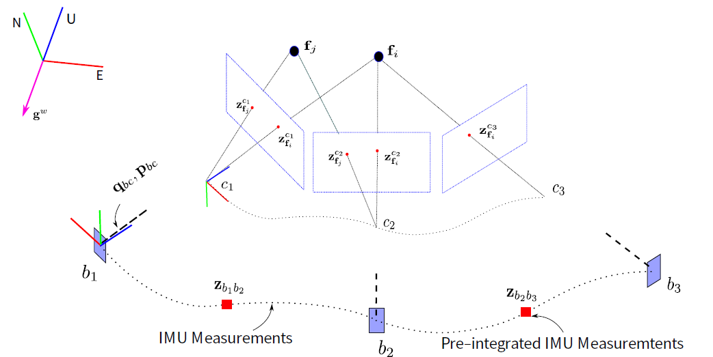

### IMU 传感器模型

$$
\begin{aligned} \tilde{\omega}^{b} &=\omega^{b}+\mathbf{b}^{g}+\mathbf{n}^{g} \\ \tilde{\mathbf{a}}^{b} &=\mathbf{q}_{b w}\left(\mathbf{a}^{w}+\mathbf{g}^{w}\right)+\mathbf{b}^{a}+\mathbf{n}^{a} \end{aligned}
$$

- IMU 传感器测量的是各轴的角速度 $\tilde{\omega}^{b}$ 和加速度 $\tilde{a}^b$ ;
- 其中的 $\mathbf{b} $ 和 $ \mathbf{n}$ 分别代表 bias 和 高斯白噪声 ;
- 加速度模型又跟世界坐标系下的重力向量 $g^w$ 有关系; 在东北天坐标系下, 它的向量表达式为 $g^w=(0,0,-9.81)$ ,指向地面 ; 
- 把加速度 $(\mathbf{a}^w - \mathbf{g}^w) $  通过 $\mathbf{q}_{bw}$ 旋转到 {Body} 坐标系下;

### 传感器数据预积分

$$
\begin{aligned} 
\boldsymbol{\alpha}_{b_{i} b_{j}} &=\iint_{t \in[i, j]}\left(\mathbf{q}_{b_{i} b_{t}} \mathbf{a}^{b_{t}}\right) \delta t^{2} \\ 
\boldsymbol{\beta}_{b_{i} b_{j}} &=\int_{t \in[i, j]}\left(\mathbf{q}_{b_{i} b_{t}} \mathbf{a}^{b_{t}}\right) \delta t \\ \mathbf{q}_{b_{i} b_{j}} &=\int_{t \in[i, j]} \mathbf{q}_{b_{i} b_{t}} \otimes\left[\begin{array}{c}{0} \\ {\frac{1}{2} \boldsymbol{\omega}^{b_{t}}}\end{array}\right] \delta t \end{aligned}
$$

- IMU 的数据采集频率 200Hz, 视觉的在 30Hz, 采取的方式就是对两个视觉数据之间的IMU数据进行预积分,  如上式中的的 $\boldsymbol{\alpha}$ 、$\boldsymbol{\beta}$ 、$\mathbf{q}$ ；
- $\boldsymbol{\alpha}_{b_i b_j}$ 代表“伪位移”的变化量的预积分，备注：这里没有包含一些重力的量；$\boldsymbol{\beta}_{b_i b_j}$ 代表“伪速度”的变化量的预积分；$\mathbf{q}_{b_i b_j}$ 代表旋转角度的预积分；
- IMU 在每一个时刻都有一个 noise，把多个IMU数据做积分之后得到一个预积分量，那这个数据值的noise是多大？ 可以通过协方差的传递对预积分量的不确定度做一个度量；

### 视觉几何基础

- 在图像中提取一些Fast角点； 通过光流或者特征描述子进行匹配；
- 有了这些匹配点，就可以利用对极几何约束来计算两帧之间的平移和旋转；
- 对极几何：相机光心 $c_1$ 和 $c_3$ 的连线，和射线 $c_1\mathbf{f}_i$ 以及 $c_3\mathbf{f}_3$ 是共面的关系， 用这个关系就可以算得 本征矩阵 $\mathbf{E}$ 矩阵 ，利用三维世界的点 $\mathbf{f}_i$ 落在这个平面上， 可以算得 $\mathbf{H}$ 矩阵；然后通过本征E矩阵和H矩阵，就可以计算相机 $c_3$ 相对于 $c_1$ 的位姿 pose（$R_{c_1c_3}  \quad T_{c_1c_3}$  ）；但平移的的真实模长是不知道的，跟真实的 $T$ 有一个尺度的差异；
- 已知相机 pose， 已知特征点的二维坐标，就可以通过三角化得到特征点对应的三维坐标；
- 通过以上步骤，则 VLSAM 系统就进行了一个较好的初始化，当新来了一个图像后，, 且世界坐标系下的3d点 $\mathbf{f}_i$ 也能匹配到新的图像上为某个2d点，这时候转化为如下问题：
  - 已知 3d 点，2d 特征点， 就可以通过 Perspective-n-Point(PnP) 方法求新的相 pose（即 $c_4$ 相对于 $c_1$ 的 $ R_{c_1c_4} \quad T_{c_1c_4}$ ，且 $T_{c_1c_4}$ 和前面的 $T_{c_1c_3}$的尺度是一样的）；

### 传感器数据与单目视觉姿态数据融合的问题

下面讨论传感器数据和单目视觉姿态数据， 这两套不同的数据轨迹，如何融合形成最优的轨迹的估计。先看看两个轨迹之间会存在什么问题：

- IMU 怎么和世界坐标系对齐， 计算初始时刻的 $\mathbf{q}_{wb_0}$
  - 根据前面的公式，可知：IMU 的轨迹计算，需要知道第一个IMU数据的 pose（即图中的 $b_1$ 相对于世界坐标系 $ENU$ 的旋转矩阵 $\mathbf{q}_{wb_1}$）；有了这个 $\mathbf{q}_{wb_1}$，就可以把世界坐标系下的一个向量， 例如 $g=(0,0,-9.81)$ 旋转到 {Body}坐标系下，也可以把{Body}坐标系下的测出来的加速度 $\boldsymbol{a}^b$ 变换到世界坐标系下加速度 $\mathbf{a}^w$,  有了这个加速度，就可以对轨迹在世界坐标系下进行推算（即对加速度进行积分）；
  - 同时，还需要去估计第一个IMU数据时刻它的速度是多少；有了速度和加速度，就可以对它的 pose 进行预测；

- 单目视觉姿态如何和 IMU 轨迹对齐， 尺度如何获取？
  - 根据前面讲过的，相机在 $b_1$ 和 $b_2$ 之间估计出来的平移变换 $T$ 和真实的平移存在一个尺度因子差异，这会导致相机姿态并不能和 IMU 轨迹在 $b_1$ 和 $b_2$ 对齐（相差尺度因子倍数）；因此需要通过 IMU 的数据去计算这个尺度因子到底是多大。

- VIO 系统的初始速度 $v$ ，传感器 bias 等如何估计？
- IMU 和 相机之间的外参数的估计？
  - 有一些系统，可能并不知道相机和 IMU 的外参数，即图中的 相机坐标系到 {Body} 坐标系的旋转 $\mathbf{q}_{bc}$ 和平移 $\mathbf{p}_{bc}$ 都不知道 ；

### IMU和视觉之间的几何约束

由于 IMU 和视觉之间是刚体互联关系, 因此存在一些几何上的约束关系, 考虑相机坐标系 $c_0$ 为世界坐标系,则利用外参 $\mathbf{q}_{bc}, \mathbf{t}_{bc}$ 可以构建等式:
$$
\begin{aligned} 
\mathbf{q}_{c_{0} b_{k}} &=\mathbf{q}_{c_{0} c_{k}} \otimes \mathbf{q}_{b c}^{-1} \\ 
s \overline{\mathbf{p}}_{c_{0} b_{k}} &=s \overline{\mathbf{p}}_{c_{0} c_{k}}-\mathbf{R}_{c_{0} b_{k}} \mathbf{p}_{b c} 
\end{aligned}
$$

- 第一个等式: 旋转的对应关系
  - 首先视觉计算得到的  $b_0$ 到 $b_2$ 的旋转矩阵 $\mathbf{q}_{c_0c2}$ 与 IMU 计算得到的旋转矩阵 $\mathbf{q}_{b_0b_2}{}$ 是没有尺度差异的;
- 等式左边 $\mathbf{q}_{c_0b_k}$ 表示 IMU 在 $b_2$ 坐标系下的轨迹点 $b_k$ 在 $c_0$ 坐标系下的表示: 
    -  首先通过  $\mathbf{q}_{bc}^{-1}$ 把 IMU 轨迹点 $b_k$ 变换到 相机坐标系 $c_k$ 下
    -  然后再用前面所说的PnP方法计算得到的两帧间的 旋转矩阵 $\mathbf{q}_{c_0c_k}$ 变换到 $c_0$ 坐标系下;

- 第二个等式: 平移的对应关系

  - 表示约定: $s$ 为尺度因子, $\overline{\mathbf{p}}$ 表示非米制单位的轨迹(即带有尺度, 例如相机算出来的平移)

  - 先从如下等价公式进行解释:  $\overline{\mathbf{p}}_{c_{0} c_{k}}=\frac{1}{s} \mathbf{R}_{c_{0} b_{k}} \mathbf{p}_{b c}+\overline{\mathbf{p}}_{c_{0} b_{k}}$

  - 等号左边表示 $c_k$ 在 $c_0$ 坐标系下的表示, 等号右边第一项表示先通过一个 $ {1  \over s  }\mathbf{p}_{bc}$ 变换到 $b2$ 坐标系下(由于最终都是带有尺度的值,因此需要给不带尺度的量 $\mathbf{p}_{bc}$  乘以 $\frac{1}{s}$ 变为带尺度的平移) , 即为上图中的 $b_k$ 点, 然后通过旋转 $\mathbf{R}_{c_0b_k}$ 可旋转到 $c_0$ 坐标系, 同时再加上第二项从 $b_k$ 到 $c_0$ 的平移 $\mathbf{p}_{bc}$ ,即为在 $c_0$ 下的坐标;

  - 由于 $\overline { \mathbf{p} }_{c_0c_k}$ ，$\mathbf{R}_{c_0b_k}$ 等已知( 为什么等式左边的 $\overline{ \mathbf{p}}_{c_0b_k}$  已知???),因此第二个公式可以用来计算尺度因子的大小 $s$; 

    

